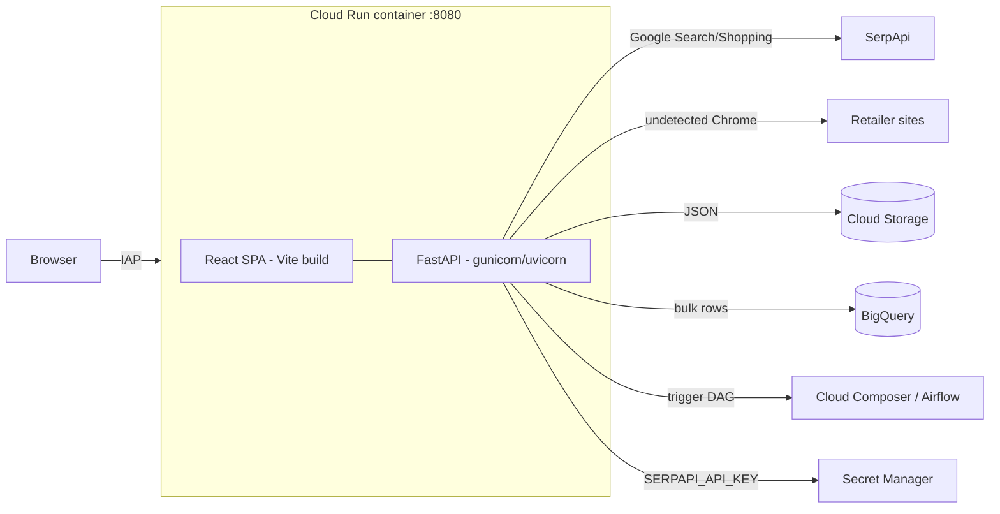

# NA Parts Price Intelligence.........

Competitor price intelligence for North American automotive parts. A FastAPI backend
scrapes live pricing from major NA retailers (via the SerpApi Google Search/Shopping
API, with a SeleniumBase + Chrome fallback) and a React (Vite) single-page app drives
live lookups, batch uploads, and exports. The service is containerized and deployed to
Google Cloud Run behind IAP.

---

## Features

- **Live single-part lookup** across one or more retailers, with streamed progress.
- **Batch lookup** for many parts at once (streamed), plus CSV / XLSX exports.
- **Collision parts** lookup against the LKQ open catalog (geo-aware, no SerpApi).
- **Bulk pipeline trigger** — upload a CSV, land rows in BigQuery, and kick off an
  Airflow (Cloud Composer) DAG.
- **Live-search SerpApi JSON persistence** to local disk and optionally Google Cloud Storage.
- Single container serves both the API and the built React app.

## Supported retailers

| Flow | Retailers |
| --- | --- |
| SerpApi (`/na-parts/*`) | AutoZone, O'Reilly, Advance Auto, NAPA, Amazon, Summit Racing, Walmart, CarParts |
| Collision (`/collision-parts/*`) | LKQ (open catalog, latitude/longitude based) |

`GET /na-parts/retailers` returns the authoritative list with each retailer's code,
language, currency, and base URL.

---

## Architecture



- **Backend** — FastAPI (`na_parts_main.py`). Local dev runs on `127.0.0.1:8001`;
  in the container it runs under gunicorn + `UvicornWorker` on `:8080`.
- **Frontend** — React 19 + Vite 7 + Redux Toolkit + Tailwind CSS. Dev server on
  `:9500` proxies `/na-parts`, `/collision-parts`, and `/api` to the backend on `:8001`.
  Vite builds to `frontend/build/`; the Docker image copies that to
  `/app/frontend/dist`, which FastAPI serves in production.

---

## Project structure

```
part_pricing_ui_serp_na_v1/
├── Dockerfile                  # Multi-stage: Vite build -> Python + Chrome runtime
├── cloudbuild.yaml             # Cloud Build -> Artifact Registry -> Cloud Run (IAP)
├── .dockerignore
├── backend/
│   ├── na_parts_main.py        # FastAPI app + routes (entry point)
│   ├── na_retailers_scraper.py # RETAILER_CONFIG + SeleniumBase/Chrome scraping
│   ├── serpapi_search.py       # SerpApi query building + result extraction
│   ├── lkq_search.py           # LKQ collision-parts catalog search
│   ├── gcs_storage.py          # Local SerpApi JSON + optional GCS persistence
│   ├── app_config.py           # config.yaml loader + SerpApi key resolution
│   ├── requirements.txt
│   └── fixtures/config.yaml    # PROJECT / LOCATION / SerpApi secret + location
└── frontend/
    ├── vite.config.js          # dev server :9500, proxy to :8001, outDir build/
    ├── package.json
    └── src/                    # App.jsx, components/, assets/
```

---

## Prerequisites

- Python 3.12 and Node.js 20
- Google Cloud SDK (`gcloud`), authenticated with access to the target project
- Docker (for local container builds / deployment)
- Network access to the Ford GCP environment (proxy + VPC-SC perimeter)

## Configuration

Runtime config is resolved from `backend/fixtures/config.yaml` first, then environment
variables. The SerpApi key is fetched from **Secret Manager** (no local `.env`
required); an optional `backend/.env` with `SERPAPI_API_KEY` is supported as a fallback.

`backend/fixtures/config.yaml`:

```yaml
PROJECT: ford-5ae865a4a2f14ba62fcc8c2d
LOCATION: us-central1
SERPAPI_SECRET_NAME: projects/798978834772/secrets/serpapi-api-key
SERPAPI_LOCATION: Dearborn, Michigan, United States
```

Common environment variables:

| Variable | Purpose | Default |
| --- | --- | --- |
| `GCP_PROJECT` | Project for GCS / BigQuery | `ford-5ae865a4a2f14ba62fcc8c2d` |
| `BQ_DATASET` / `BQ_TABLE` | Bulk pipeline landing table | `part_pricing_landing` / `na_retailers_brand_parts` |
| `COMPOSER_API_URL` / `COMPOSER_IAP_CLIENT_ID` | Airflow DAG trigger (bulk) | empty |
| `LKQ_LATITUDE` / `LKQ_LONGITUDE` | Default location for LKQ search | `38.742271` / `-97.262715` |
| `SERP_DATA_LOCAL_ENABLED` | Save live-search SerpApi JSON responses locally | `1` |
| `SERP_DATA_LOCAL_DIR` | Local JSON root (relative paths resolve from `backend/`) | `serp_data` |
| `SERP_DATA_BATCH_GCS_ENABLED` | Upload batch result JSON to GCS by date and part number | `0` |
| `SERP_DATA_GCS_MODE` | `impersonate_vip` (local) or `native` (Cloud Run) | `impersonate_vip` |
| `SERP_DATA_BUCKET` | GCS bucket for SerpApi JSON | `m1-analytics-part-pricing-dev` |
| `SERPAPI_API_KEY` | Manual fallback if Secret Manager is unavailable | empty |
| `HTTP_PROXY` / `HTTPS_PROXY` / `NO_PROXY` | Ford network egress | set in Dockerfile / Cloud Build |

---

## Local development

Authenticate first so GCS, Secret Manager, and BigQuery calls work:

```bash
gcloud auth login
gcloud auth application-default login
```

### Backend

```bash
cd backend
python -m venv .venv && source .venv/bin/activate
pip install -r requirements.txt
python na_parts_main.py          # serves http://127.0.0.1:8001
```

### Frontend

```bash
cd frontend
npm install
npm run dev                      # serves http://localhost:9500 (proxies to :8001)
```

Open http://localhost:9500.

---

## API reference

Base path (production): served on the Cloud Run URL; locally on `http://127.0.0.1:8001`.

| Method | Path | Description |
| --- | --- | --- |
| `GET` | `/na-parts/health` | Health check |
| `GET` | `/na-parts/retailers` | Supported retailers and metadata |
| `POST` | `/na-parts/scrape-live` | Scrape one part across retailers |
| `POST` | `/na-parts/scrape-live-stream` | Same, with streamed progress |
| `POST` | `/na-parts/scrape-batch-stream` | Scrape many parts (streamed) |
| `POST` | `/collision-parts/scrape-live` | LKQ collision-part lookup |
| `POST` | `/na-parts/export-csv` | Export a results list to CSV |
| `POST` | `/na-parts/export-batch-xlsx` | Export batch rows to XLSX |
| `GET` | `/na-parts/batch-template` | Download the XLSX batch template |
| `POST` | `/na-parts/trigger-bulk` | Upload CSV -> BigQuery -> trigger DAG |

Example — live scrape:

```bash
curl -X POST http://127.0.0.1:8001/na-parts/scrape-live \
  -H "Content-Type: application/json" \
  -d '{
        "part_number": "RS55047A",
        "brand_name": "Rancho",
        "retailers": ["AutoZone", "O'\''Reilly", "NAPA"]
      }'
```

Example — collision (LKQ) lookup:

```bash
curl -X POST http://127.0.0.1:8001/collision-parts/scrape-live \
  -H "Content-Type: application/json" \
  -d '{ "part_number": "FO1000648", "latitude": 42.3223, "longitude": -83.1763 }'
```

---

## Docker

The multi-stage `Dockerfile` builds the Vite frontend, then assembles a Python 3.12
runtime with Google Chrome + SeleniumBase for scraping.

```bash
# Build (run from this directory)
docker build -t na-parts-ui .

# Run
docker run --rm -p 8080:8080 \
  -e GCP_PROJECT=ford-5ae865a4a2f14ba62fcc8c2d \
  na-parts-ui
# App: http://localhost:8080
```

> Proxy defaults target the Ford GCP network (`internet.gcp.ford.com:83`) and are
> passed as build args from Cloud Build; override them for other environments.

## Deploy to GCP

Deployment is driven by `cloudbuild.yaml`: build the image, push to Artifact Registry,
deploy to **Cloud Run** (IAP-protected, `ford.com` domain access), and bind IAP access.

```bash
gcloud builds submit --config cloudbuild.yaml .
```

Cloud Run settings applied by the pipeline: 4 GiB memory, 2 vCPU, concurrency 1,
`min-instances 1`, internal + load-balancing ingress, VPC egress `all-traffic`, and
`SERPAPI_API_KEY` mounted from Secret Manager. Override substitutions
(`_IMAGE_NAME`, `_SERVICE_NAME`, `_REGION`, `_VPC_CONNECTOR`, …) per environment.

---

## Data & storage

- **Local JSON** — live-search SerpApi responses are saved under
  `backend/serp_data/live_search_data/` by default. Batch uploads do not save local JSON.
- **Cloud Storage** — batch results are uploaded under
  `serp_data/batch_search_data/<YYYYMMDD>/<PART_NUMBER>.json`. Live-search payloads
  can optionally be uploaded under `serp_data/live_search_data/`. Locally the
  uploader impersonates a service account and routes through Google's restricted VIP
  (`199.36.153.4`); inside the VPC-SC perimeter it uses native ADC.
- **BigQuery** — `/na-parts/trigger-bulk` inserts uploaded rows into the landing table
  (`part_pricing_landing.na_retailers_brand_parts`) with `price = NULL`.
- **Cloud Composer / Airflow** — the bulk trigger then starts the
  `dag_trigger_parts_pricing_cldrun_na` DAG.

## Tech stack

- **Backend:** FastAPI, Uvicorn/Gunicorn, SerpApi (`google-search-results`),
  SeleniumBase + undetected Chrome, `curl_cffi`, pandas/openpyxl,
  `google-cloud-{storage,bigquery,secret-manager,vision}`, Vertex AI.
- **Frontend:** React 19, Vite 7, Redux Toolkit / redux-saga / redux-persist,
  React Router 7, Tailwind CSS 4, axios, react-markdown.
